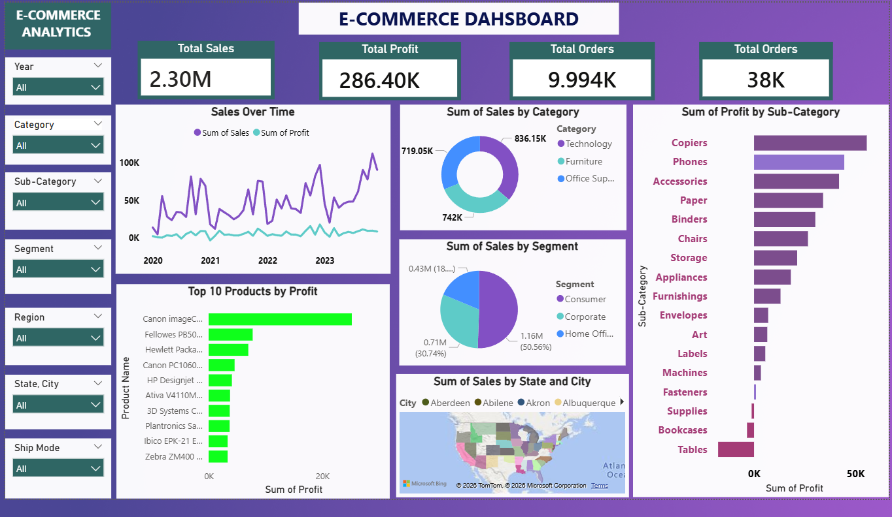

# 🛒 E-Commerce Analytics Dashboard

## 📊 Dashboard Preview

---

## 📌 Overview

This project presents an interactive E-Commerce Analytics Dashboard built using Power BI.

The dashboard helps analyze:

- Total Sales
- Total Profit
- Total Orders
- Category-wise Sales
- Segment-wise Performance
- Top Products by Profit
- State & City-wise Sales Analysis

---

## 📈 Key Insights

- 💰 Total Sales: 2.30M
- 📈 Total Profit: 286.40K
- 📦 Total Quantity Ordered: 38K
- 🛒 Technology category generated highest sales
- 📱 Copiers and Phones produced high profits
- 📉 Tables category showed negative profit trends

---

## ⚙️ Features

- ✅ Interactive slicers and filters
- 📊 KPI Cards
- 📈 Sales trend analysis
- 🥧 Category and Segment breakdown
- 🗺 Geographic sales visualization
- 📦 Top 10 products by profit

---

## 🛠 Tools Used

- Power BI
- Microsoft Excel
- Data Cleaning
- Data Visualization

---

## 📁 Files Included

- `Ecommerce_Dashboard.pbix` → Power BI dashboard file
- `dataset.xlsx` → Dataset used for analysis
- `dashboard.png` → Dashboard preview image

---

## 🚀 How to Use

1. Download the `.pbix` file
2. Open it using Power BI Desktop
3. Use slicers and filters to explore insights

---

## 📌 Project Purpose

This project is created for:

- 📊 Data Analyst Portfolio
- 📚 Power BI Practice
- 🎯 Business Sales Analysis
- 💼 Showcasing Dashboard Skills

---

## 💡 Future Improvements

- Add real-time sales tracking
- Improve UI/UX design
- Add forecasting analysis
- Deploy dashboard online

---

## ⭐ Support

If you like this project, give it a ⭐ on GitHub!
